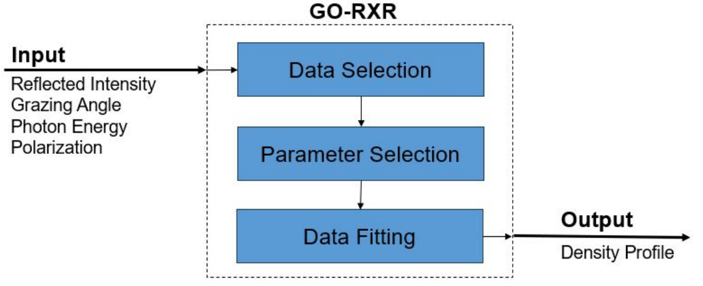

# Summary and statement of Need

Resonant x-ray reflectometry (RXR) is a cutting-edge synchrotron technique used to characterize the depth-dependent structure of quantum materials [@keimer_moore_NPh_2017; @green-etal_SRN_2020]. However, the main challenge impeding the success of RXR data analysis lies in its extreme complexity, which necessitates both extensive computational quantum mechanics simulations and the fitting of numerous independent variables. This complexity results in prolonged analysis periods that demand significant engagement from researchers. In response to these challenges, the Global Optimization of Resonant X-ray Reflectometry (GO-RXR) software emerged from rigorous development efforts as a main contribution from the work by [@korol_MSc_2023]. GO-RXR streamlines data analysis, enhances visualization, and reduces the expertise required, offering researchers a more efficient means to analyze RXR data. 

One of the challenges addressed by [@korol_MSc_2023] included the analysis of LaMnO3/SrTiO3 thin-film heterostructures. The data for these samples were collected at the resonant elastic and inelastic x-ray scattering beamline (REIXS) at the CLS back in 2017. Despite the initial data collection taking only three days, attempts to analyze it in 2021 yielded little success. However, in 2023, utilizing the GO-RXR tool led to a successful analysis, highlighting its efficacy in overcoming longstanding analysis barriers.

The analysis of RXR presents multifaceted challenges, extending beyond computational aspects to encompass expertise in materials and the physics of light-matter interactions. This expertise is pivotal, as it provides intuition about parameter adjustments and guides the direction of data analysis to achieve desired outcomes. In addressing this challenge, GO-RXR integrates global optimization algorithms, thereby lowering the expertise threshold necessary for effective data analysis. Through the extensive development of GO-RXR, diverse global optimization algorithms and unique objective functions were meticulously explored. The software's capability to capture features in experimental data without exhaustive parameter understanding significantly reduces the expertise required. GO-RXR serves as an indispensable scientific tool for material scientists, offering advanced capabilities to streamline data analysis and reduce the expertise barrier, ultimately facilitating breakthrough discoveries in the field of materials science.

# Comparison

The development of GO-RXR responds to the critical need for improved tools to analyze RXR data effectively. GO-RXR distinguishes itself from existing RXR data analysis tools through its comprehensive approach and user-friendly design. Unlike command-line-based programs, GO-RXR offers a graphical user interface (GUI) and intuitive plotting options, facilitating data interpretation and analysis. Furthermore, GO-RXR incorporates state-of-the-art global optimization algorithms, allowing for faster and more accurate data fitting compared to traditional methods. Its ability to model thin-film materials and customize objective functions makes it a versatile and indispensable tool for researchers in the field.

# Functionality

GO-RXR is readily available for installation through its GitHub repository, providing users with easy access to its functionality. The accompanying documentation offers thorough guidance, including detailed installation instructions, a user guide, and tutorials featuring two example cases solved step-by-step. This comprehensive support ensures that users can quickly grasp the software's features and efficiently apply them to their data analysis tasks.

## Basic concepts

The primary goal of GO-RXR is to simplify and optimize the data analysis process for resonant x-ray reflectometry. Initially conceived as a command-line tool, it evolved into a GUI-based software with enhanced visualization capabilities. 

*TO ADD details of language, packages, and libraries used*

Figure \autoref{fig:flowchart} displays the main steps GO-RXR uses to convert the input into its output. The inputs of the software is the experimental data, and are defined by the reflected intensity, incident grazing angle, photon energy, and polarization. The first step in the data analysis is the data selection step. In this step the user selects the experimental datasets to include into the data analysis. The next step is the parameter selection. In this step, the user selects the model parameters to vary. The final step is known as the data fitting step. In this step, the user will select the global optimization algorithm to implement, along with the algorithm parameters, and start the data fitting between the simulated and selected experimental datasets. The output of GO-RXR is the depth-dependent density profile and it is defined my its model parameters.

## Example use-cases

The GO-RXR software has been instrumental in analyzing RXR data for diverse applications. For instance, it has facilitated the in-depth study of the electrochemical water splitting catalyst La0.7 Sr0.3 MnO3/SrTiO3 (LSMO/STO), revealing insights into the material's structural, electronic, and magnetic depth profiles. Moreover, GO-RXR's utilization in investigating the thickness relationship between film thickness and the presence of ferromagnetism in the LaMnO3/SrTiO3 heterostructure has shed new light on the mechanisms underlying magnetic phase transitions in ultra-thin films. 

*The versatility of GO-RXR can be leveraged in the analysis of various other quantum materials, such as semiconductors, superconductors, and magnetic materials, to elucidate their depth-dependent structures and properties. Additionally, GO-RXR could find application in materials science research, where understanding the structural and electronic characteristics of thin films is crucial for designing advanced electronic devices and functional materials. Furthermore, its ability to streamline data analysis processes and enhance visualization can benefit researchers across different disciplines, including physics, chemistry, and materials engineering, by providing them with a powerful tool for studying complex material systems with greater efficiency and accuracy.*

# Publications and ongoing research

*Mention (if applicable) a representative set of past or ongoing research projects using the software and recent scholarly publications enabled by it.*

# Acknowledgments

Give the proper acknowledgments.

# References
