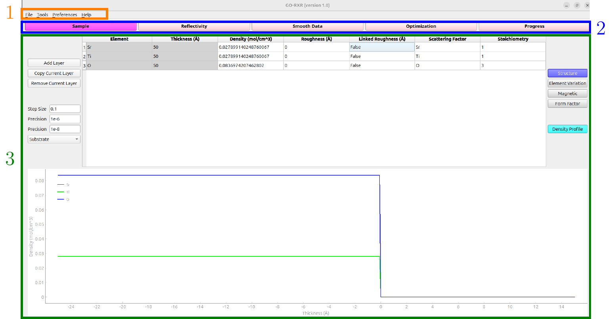

# Summary

Resonant x-ray reflectometry (RXR) is a cutting-edge synchrotron technique used to characterize the depth-dependent structure of quantum materials [@keimer_moore_NPh_2017; @green-etal_SRN_2020]. However, the main challenge impeding the success of RXR data analysis lies in its extreme complexity, driven by complicated model construction and the fitting of numerous independent variables. This complexity results in prolonged analysis periods that demand significant engagement from researchers. In response to these challenges, the Global Optimization of Resonant X-ray Reflectometry (GO-RXR) software emerged from rigorous development efforts as a main contribution from the work by [@korol_MSc_2023]. GO-RXR streamlines data analysis, enhances visualization, and reduces the expertise required, offering researchers a more efficient means to analyze RXR data. 

This paper presents an overview of GO-RXR, highlighting its functionality, example use-cases, and impact in materials science research. Through its comprehensive approach and user-friendly design, GO-RXR offers researchers an efficient tool for analyzing RXR data, facilitating breakthroughs in understanding complex material systems. Additionally, publications and ongoing research utilizing GO-RXR underscore its versatility and impact in advancing scientific exploration.

# Statement of Need

One of the challenges addressed by [@korol_MSc_2023] included the analysis of LaMnO3/SrTiO3 thin-film heterostructures. The data for these samples were collected at the resonant elastic and inelastic x-ray scattering beamline (REIXS) at the Candian Light Source (CLS) in 2017. Although the initial data collection took only three days, attempts to analyze it with the tools available in 2021 yielded little success. In 2023, use of the GO-RXR tool led to a successful analysis, highlighting the efficacy of the software in overcoming longstanding analysis barriers.

The analysis of RXR presents multifaceted challenges, extending beyond computational aspects to encompass expertise in materials and the physics of light-matter interactions. This expertise is pivotal because it provides intuition about parameter adjustments and guides the direction of data analysis to achieve desired outcomes. In addressing this challenge, GO-RXR integrates global optimization algorithms, thereby lowering the expertise threshold necessary for effective data analysis. Through the extensive development of GO-RXR, diverse global optimization algorithms and unique objective functions were thoroughly explored. The software's capability to capture features in experimental data without exhaustive parameter understanding significantly reduces the expertise required. GO-RXR serves as a valuable scientific tool for material scientists, offering advanced capabilities to streamline data analysis and reduce the expertise barrier, ultimately facilitating breakthrough discoveries in the field of materials science.

# Comparison

To the best of our knowledge, no existing software tool comprehensively addresses the general problem of RXR data analysis across a wide range of materials and conditions. Most of the currently available tools are designed for very specific tasks and cannot be extensively applied to the diverse challenges encountered in RXR studies. For example, tools like GenX [@bjorck2007_genx] and Motofit [@nelson2006_motofit] are widely used for reflectometry but are primarily focused on specific types of reflectivity data analysis, such as neutron or x-ray reflectometry, without the capability to handle the complex, element-specific interactions in RXR. Similarly, more modern tools like Refl1D [@nelson2014_refl1d] and BornAgain [@durniak2015_bornagain] offer powerful features for modeling and fitting specific types of reflectometry data but still lack the flexibility and comprehensive approach needed for the broad range of challenges in RXR analysis.

The development of GO-RXR is a response to the critical need for improved tools to analyze RXR data effectively. GO-RXR distinguishes itself from existing RXR data analysis tools through its comprehensive approach and user-friendly design. GO-RXR offers a graphical user interface (GUI) and intuitive plotting options, facilitating data interpretation and analysis. Furthermore, GO-RXR incorporates state-of-the-art global optimization algorithms, allowing for faster and more accurate data fitting compared to older methods. Its ability to model thin-film materials and customize objective functions makes it a versatile and valuable tool for researchers in the field of material science.

# Functionality

GO-RXR is available for installation through its GitHub repository, providing users with easy access to its functionality. The accompanying documentation offers thorough guidance, including detailed installation instructions, a user guide, and tutorials featuring two example cases solved step-by-step. This comprehensive support ensures that users can quickly grasp the software's features and efficiently apply them to their data analysis tasks.

## Basic concepts

The primary goal of GO-RXR is to simplify and optimize the data analysis process for resonant x-ray reflectometry. Initially conceived as a command-line tool, it evolved into a GUI-based software with enhanced visualization capabilities. Developed using Python with PyQt5 for the interface, this software integrates the Pythonreflectivity [@pythonreflectivity] open-source package to carry out reflectivity calculations efficiently. GO-RXR has been tested extensively on Ubuntu 22.04 with Python 3.10, ensuring reliable performance on this operating system. After running the GUI_GO.py file, the start screen in \autoref{fig:start-screen} will be displayed.

\autoref{fig:flowchart} displays the main steps GO-RXR uses to go from input to output. The inputs of the software are the experimental data and are defined by the reflected intensity, incident grazing angle, photon energy, and polarization. The first step in the data analysis is the data selection step. In this step, the user selects the experimental datasets to include into the data analysis. The next step is the parameter selection. In this step, the user selects the model parameters to vary. The final step is the data fitting. In this step, the user selects the global optimization algorithm and its parameters and fits the data from the selected experimental and simulated datasets. The output of GO-RXR is the depth-dependent density profile, as defined by the model parameters.

GO-RXR incorporates three global optimization algorithms specifically designed to tackle the inherent complexities of RXR data analysis. These are Differential Evolution (DE) [@storn1997_de], Simplicial Homology Global Optimization (SHGO) [@endres2018_shgo], and Dual Annealing [@xiang1997_dual_annealing], each chosen for their effectiveness in handling the high-dimensional optimization challenges typical of RXR. A significant enhancement provided by GO-RXR is the integration of boundary and weight functions, which enable the selective emphasis of specific data regions, thereby improving the precision and relevance of the optimization results [@korol_MSc_2023]. Additionally, the objective function includes a total variation penalty, ensuring that the optimization not only fits the data but also preserves its physical trends, resulting in more accurate and reliable outcomes [@korol_MSc_2023]. These global optimization algorithms, combined with  local optimization nonlinear least-squares algorithms for post-processing refinement, allow GO-RXR to effectively model the structural and electronic properties of thin-film materials. The algorithms are implemented within GO-RXR using the SciPy library [@virtanen2020_scipy]. \autoref{fig:optimization} displays the Optimization workspace, which includes sections for parameter boundaries, objective function selection, and algorithm parameters, allowing users to fine-tune the optimization process to achieve the most accurate and physically meaningful results.

## Example use-cases

The GO-RXR software has been instrumental in analyzing RXR data for diverse applications. For instance, it has facilitated the in-depth study of the electrochemical water splitting catalyst La0.7 Sr0.3 MnO3/SrTiO3 (LSMO/STO), revealing insights into the material's structural, electronic, and magnetic depth profiles. Moreover, GO-RXR's utilization in investigating the relationship between film thickness and the presence of ferromagnetism in the LaMnO3/SrTiO3 heterostructure has shed new light on the mechanisms underlying magnetic phase transitions in ultra-thin films.

The adaptability of GO-RXR extends to analyzing a wide array of quantum materials, including semiconductors, superconductors, and magnetic materials, allowing researchers to explore their depth-dependent structures and properties. More generally, GO-RXR could be applied to materials science research, particularly in comprehending the structural and electronic attributes for designing cutting-edge electronic devices and functional materials, especially thin films. Furthermore, its ability to streamline data analysis processes and enhance visualization can benefit researchers across different disciplines, including physics, chemistry, and materials engineering, by providing them with a robust tool for studying complex material systems with greater efficiency and accuracy.

# Publications and ongoing research

The GO-RXR software package was utilized for analyzing the RXR data in the paper titled "The effect of intrinsic magnetic order on electrochemical water splitting" published in the journal Applied Physics Reviews by [@vanderMinne_etal_2023]. Additionally, GO-RXR played a valuable role in a complementary experimental study investigating morphological and chemical disorder in epitaxial La0.67Sr0.33MnO3. This study has been accepted for publication in the journal ACS Applied Materials & Interfaces, with its preprint format available online [@verhage_etal_2023]. These instances underscore the versatility and impact of GO-RXR in advancing scientific exploration, with ongoing research endeavors continuing to harness its capabilities for further discoveries.

# Acknowledgments

Robert J. Green and Raymond J. Spiteri acknowledge the support
from the Natural Sciences and Engineering Research Council of
Canada (NSERC) Discovery Grant program. Lucas Korol
acknowledges the support from the NSERC CREATE to INSPIRE
program. 

# References
