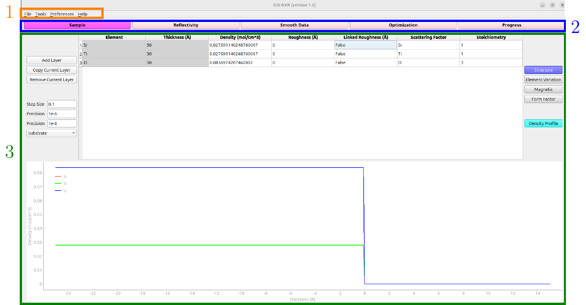

<h1 align="center">
  <a href="https://imgur.com/3ZJbg84"></a>
</h1>

<h1 align="center">
  <br>
  Global Optimization of Resonant X-ray Reflectometry
  <br>
</h1>

<h4 align="center">A scientific tool for material scientists.</h4>

<p align="center">
  <a href="#key-features">Key Features</a> •
  <a href="#installation">Install/Configure</a> •
  <a href="#documentation">How-to-use</a> •
  <a href="#credits">Credits</a> •
  <a href="#license">License</a> •
  <a href="#publications">Publications</a> 
</p>

<a href="https://imgur.com/kPS6E3D"></a>

## Key Features

* Graphical User Interface
* Sample definition as a compound-profile
* Adaptive Layer Segmentation
* Internal database of form factors
  - allows for selection of form factors in project file
* Magnetism capabilities
* Compatibility with ReMagX
  - able to load in dataset from ReMagX '.all' file type
* Script functionality with built in functions
* Customizable cost function in data fitting
  - chi-square, L1-norm, and L2-norm regularization
  - create unique boundaries for select data scans with weights associated to them
  - shape parameterization using total variation
* Data smoothing
  - this is specifically used for the shape parameterization
* Progress workspace


# Getting Started

## Linux (this is the recommended configuration)

Tested on Ubuntu 22.04

### Installation

#### 1. Clone GO-RXR from the main branch in this repository:
```bash
$ git clone https://github.com/lucaskorol21/GO-RXR.git
```

#### 2. Prerequisites and Setup (Tested with Python 3.10.14)

1. **Set Up the Virtual Environment**

   - **Create the virtual environment**:  
     Inside the `GO-RXR` directory:  
      ```bash
      $ virtualenv -p python3.10 venv-go-rxr
      ```

   - **Activate the virtual environment**:  
     Activate the virtual environment directory:  
     ```bash
     (venv-go-rxr) $ source venv-go-rxr/bin/activate
     ```

2. **Install Package Dependencies**

    Install the required Python packages using `pip`:

    ```bash
    (venv-go-rxr) $ pip install .
    ```

This command will handle the installation of all dependencies, including compiling any Cython extensions.


### Running the Application

  - Go back to the root of the repository and run the GUI:  
    ```bash
    (venv-go-rxr) $ python GUI_GO.py
    ```

After running the `GUI_GO.py` file, the start screen will be displayed:



### Troubleshooting Installation Issues

#### For `matplotlib`, ensure that you have `Pillow` installed
```bash
(venv-go-rxr) $ pip install Pillow
```

#### Resolving `PyQt5` Conflicts.

If you encounter conflicts with the PyQt5 package during installation or usage, [this discussion](https://stackoverflow.com/questions/74997556/problem-with-pyqt5-in-ubuntu-22-04-not-fount-zdapvm) might be useful. Try the following steps:

```bash
# Install necessary dependencies
$ sudo apt-get install pyqt5-dev libqt5multimedia5-plugins -y

# Remove existing PyQt5 installations from the virtual environment
$ sudo rm -f -r /usr/lib/python3/dist-packages/PyQt5 /path/to/your/virtualenv/lib/python3.x/site-packages/PyQt5

# Create a symbolic link from the OS libraries to the virtual environment
$ sudo ln -f -s /usr/lib/python3/dist-packages/PyQt5 /path/to/your/virtualenv/lib/python3.x/site-packages/PyQt5
```
Replace /path/to/your/virtualenv with the path to your virtual environment directory and 3.x with the appropriate Python version (e.g., 3.10, 3.9, etc.). These commands aim to ensure that the global version of PyQt5 matches the one specified in your setup file by using the operating system's libraries and creating a symbolic link accordingly.

## Windows (using WSL)

For Windows users, we recommend using Windows Subsystem for Linux (WSL) to run GO-RXR. WSL allows you to run a full Linux distribution alongside your Windows installation without the need for a virtual machine or dual-boot setup. This method provides a more consistent and reliable environment, especially for projects like GO-RXR that are designed to work seamlessly on Linux.

This configuration was tested on Windows 11 Home and Windows 11 Education.

### Steps to Set Up and Run GO-RXR on Windows Using WSL

1. **Install WSL and Ubuntu**

   - **Enable WSL**:  
     Open a PowerShell terminal as Administrator and run:  
     ```bash
      $ wsl --install
     ```
     Recommended: install Ubuntu 22.04 if available.

   - **Restart your computer**:  
     After the installation, restart your computer.

   - **Set up Ubuntu**:  
     After restarting, open the Ubuntu application (you should find it in the Start Menu).  
     Follow the prompts to create a new UNIX username and password.

2. **Update and Upgrade Ubuntu**

   - **Open Ubuntu Terminal**:  
     Update the package list:  
     ```bash
      $ sudo apt update
     ```
     
     Upgrade the installed packages:  
     ```bash
      $ sudo apt full-upgrade -y
     ```

3. **Set Up Python Environment**

   - **Check/Install Python version**:  
     You may already have Python installed with Ubuntu. Check the version:  
     ```bash
      $ python3 --version
     ```
     Recommended: Python 3.10.12 if available.

   - **Install `virtualenv`**:  
     Install the virtual environment tool:  
     ```bash
      $ sudo apt install python3-virtualenv -y
     ```

4. **Clone the Repository**

   - **Install Git (if not already installed)**:  
     Git should already be installed, but you can install it with:  
     ```bash
      $ sudo apt install git -y
     ```

   - **Clone the `GO-RXR` repository**:  
     Clone the repository using Git:  
     ```bash
      $ git clone https://github.com/lucaskorol21/GO-RXR.git
     ```
     
     Navigate to the cloned directory:  
     ```bash
     $ cd GO-RXR/
     ```

5. **Set Up the Virtual Environment**

   - **Create the virtual environment**:  
     Inside the `GO-RXR` directory:  
     ```bash
      $ virtualenv venv-go-rxr
     ```

   - **Activate the virtual environment**:  
     Activate the virtual environment directory:  
     ```bash
      (venv-go-rxr) $ source venv-go-rxr/bin/activate
     ```

6. **Install Package Dependencies**

  Install the required Python packages using `pip`:

  ```bash
  (venv-go-rxr) $ pip install .
  ```

  This command will handle the installation of all dependencies, including compiling any Cython extensions.

7. **Running the Application**

   - Go back to the root of the repository and run the GUI:  
     ```bash
     (venv-go-rxr) $ python GUI_GO.py
     ```

#### Resolving `PyQt5` Conflicts.

If you encounter conflicts with the PyQt5 package during installation or usage (issues were noticed on Windows 11 Education) you might need to update the `wsl` version. Try the following steps:

1. **Update WSL**:  
   Open a new console and run:

    ```bash
    $ wsl --update
    ```

2. **Run the GUI**:

    After updating WSL, return to the Ubuntu console and run:

    ```bash
    (venv-go-rxr) $ python GUI_GO.py
    ```

## Testing

### Automated Testing via GitHub Actions

The non-GUI tests are automatically run on every push and merge to the repository through GitHub Actions. This ensures that any new code changes do not introduce regressions or errors in the core functionality of the software.

### Running Tests Locally

You can also run all tests locally using the test scripts provided in the `TESTS` folder. This includes both GUI and non-GUI tests.

#### 1. Running All Tests

To run all tests at once, you can use the `run_all_tests.py` script in the `TESTS` directory:

```bash
(venv-go-rxr) $ python TESTS/run_all_tests.py
```

This script will execute all the test scripts in the `TESTS` folder.

#### 2. Running Individual Tests

If you wish to run specific tests, you can directly execute the individual test scripts. For example:

- To test data fitting functionalities:
  ```bash
  (venv-go-rxr) $ python TESTS/test_data_fitting.py
  ```

- To test the GUI functionality:
  ```bash
  (venv-go-rxr) $ python TESTS/test_GUI.py
  ```

- To test the reflectivity functions:
  ```bash
  (venv-go-rxr) $ python TESTS/test_reflectivity.py
  ```

### Test Coverage

The tests cover the following components of the GO-RXR software:

- **Data Fitting**: Ensures that the data fitting algorithms work correctly.
- **Data Structure**: Validates the integrity and correctness of the data structure used within the software.
- **Density Calculations**: Verifies the density calculations related to material properties.
- **Material Models**: Tests the material models to ensure they are defined and processed correctly.
- **Material Structure**: Checks the integrity and correctness of the material structure and its interactions within the software.
- **Reflectivity Calculations**: Validates the reflectivity calculations that are central to the analysis performed by GO-RXR.
- **Graphical User Interface (GUI)**: Ensures that the GUI is functioning as expected, including the interaction with user inputs and visual outputs.

Make sure to have the virtual environment activated and all dependencies installed before running the tests.


## Documentation

The User Guide can be found in `/DOCS`. Also, the file `Tutorial/Tutorial.pdf` contains two detailed examples describing the step-by-step procedures to start using the GUI.

## Credits

This software uses the following open source packages:
- [Pythonreflectivity](https://github.com/malaclypseII/PyXMRTool.git)

Contribution made by:
 - Dr. Robert J. Green
 - Dr. Raymond Spiteri
 - Dr. Jesus Perez Curbelo
 - [QMax Group](https://research-groups.usask.ca/qmax/)
 - [Numerical Simulations Research Lab](https://simlab.usask.ca/)

GO-RXR would have not been possible without the University of Saskatchewan and the funding provided by the U of S Physics and Engineering Physics Department, the NSERC-CREATE to INSPIRE fellowship, and the NSERC CGS M.

## License

GO-RXR has been developed by the QMaX and Numerical Simulation Lab at the Department of Physics and Engineering Physics, University of Saskatchewan. The distribution of GO-RXR is subject to the terms and conditions of the [BSD 3-Clause License](LICENSE). For specific details, please refer to the LICENSE file included with this distribution.

## Contributing

We welcome contributions from the community! If you're interested in contributing to GO-RXR, please read our [Contribution Guidelines](CONTRIBUTING.md) for more information.

## Publications

The GO-RXR software package has been utilized for analyzing the RXR data in the papers:
* Emma van der Minne, Lucas Korol, Lidewij M. A. Krakers, Michael Verhage, Carlos M. M. Rosário, Thijs J. Roskamp, Raymond J. Spiteri, Chiara Biz, Mauro Fianchini, Bernard A. Boukamp, Guus Rijnders, Kees Flipse, Jose Gracia, Guido Mul, Hans Hilgenkamp, Robert J. Green, Gertjan Koster, Christoph Baeumer; *The effect of intrinsic magnetic order on electrochemical water splitting*. **Appl. Phys. Rev**. 1 March 2024; 11 (1): 011420. https://doi.org/10.1063/5.0174662
* Michael Verhage, Emma van der Minne, Ellen M. Kiens, Lucas Korol, Raymond J. Spiteri, Gertjan Koster, Robert J. Green, Christoph Baeumer, Kees Flipse; *A complementary experimental study of epitaxial La0.67Sr0.33MnO3 to identify morphological and chemical disorder*. **arXiv**. 1 Nov 2023. https://arxiv.org/abs/2311.00504 (under review in the journal **ACS Applied Materials & Interfaces**)

## Bugs
* Resolved (5/10/2023): Data fitting will run the script regardless if script option is selected. It is suggested to comment out every line of the script for now until this issues is resolved.
* Issues with providing an element variation identifier with the same name as a previously defined element. If possible always provide a different element variation identifier name that is different than any of the element names provided in any layer.

---

If you encounter any issues, feel free to contact me at lsk601@usask.ca.

